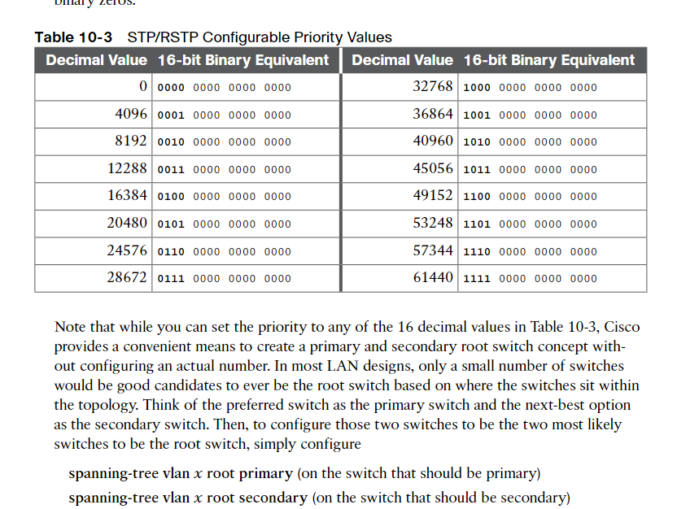

Here it all is again for another check (I'm not doing portfast or anything that is beyond the scope of the instructions provided, that may not pass packet tracer's automated assesment)

# MLS0
```
en
conf t
hostname MLS0

! Change spanning tree mode to Rapid PVST
spanning-tree mode rapid-pvst

! Put all horizonatl links on port channel 5
interface range gig1/1/3 - 4
! Etherchannel Configuration (Add interfaces to etherchannel group)
channel-group 5 mode on
! Make links to Switch0 portchannel 2
interface range g1/1/1 - 2
! Etherchannel Configuration (Add interfaces to etherchannel group)
channel-group 2 mode on

! Ensure Po5/Po2 exist and are trunks
interface port-channel 5
! Switchport command is needed to use this as a layer 2 port
switchport
switchport mode trunk
!
interface port-channel 2
! Switchport command is needed to use this as a layer 2 port
switchport
switchport mode trunk

! VLAN Configs (Add all VLANs to all switches so that VLAN broadcasts work even if a PC on a different VLAN is on a different switch)
exit
! Add VLAN 1000 (PC2 and PC1)
vlan 1000
! Add VLAN 500 (So Broadasts work in vlan 500)
vlan 500
! Add int 0/1 to VLAN 1000
int g1/0/1
switchport mode access
switchport access vlan 1000
```

# MLS1
```
en
conf t
hostname MLS1

! Change spanning tree mode to Rapid PVST
spanning-tree mode rapid-pvst

! Put all horizonatl links on port channel 5
interface range gig1/1/3 - 4
channel-group 5 mode on
! Now that we have our interfaces asa port channel, configure it as a trunk
interface port-channel 5
! Switchport command is needed to use this as a layer 2 port
switchport
switchport mode trunk
! Make the individual links between Switch1 and MLS1 trunks (don't use a port channel)
interface range gig1/1/1 - 2
! Switchport command is needed to use this as a layer 2 port
switchport
switchport mode trunk

! VLAN Configs (Add all VLANs to all switches so that VLAN broadcasts work even if a PC on a different VLAN is on a different switch)
! Add VLAN 500 (PC0 and PC3)
vlan 500
! Add VLAN 1000 (So Broadasts work in vlan 1000)
vlan 1000
! Add int 0/1 (The one that is connected to the PC) to VLAN 500
int g1/0/1
switchport mode access
switchport access vlan 500

```

# SWITCH-00
```
en
conf t
hostname SWITCH-00

! Change spanning tree mode to Rapid PVST
spanning-tree mode rapid-pvst

! Horizontal Po5 (interfaces fa0/10, fa0/11, fa0/17)
interface range fa0/10 - 11 , fa0/17
channel-group 5 mode on
! Make sure Po5 exists and is a trunk
interface port-channel 5
switchport mode trunk

! To MLS0 Po2
interface range g0/1 - 2
channel-group 2 mode on
!
interface port-channel 2
switchport mode trunk
exit

! VLAN Configs (Add all VLANs to all switches so that VLAN broadcasts work even if a PC on a different VLAN is on a different switch)
! Add VLAN 500 (PC0 and PC3)
vlan 500
! Add VLAN 1000 (So Broadasts work in vlan 1000)
vlan 1000
! Add int 0/1 to VLAN 500
int f0/1
switchport mode access
switchport access vlan 500
```

# SWITCH-01
```
en
conf t
hostname SWITCH-01

! Change spanning tree mode to Rapid PVST
spanning-tree mode rapid-pvst

! Horizontal Po5
interface range fa0/10 - 11 , fa0/5
channel-group 5 mode on
! Ensure Po5 exists and is a trunk
interface port-channel 5
switchport mode trunk
!
! To MLS1 (no port-channel) - set as trunks
interface range g0/1 - 2
switchport mode trunk
exit

! VLAN Configs (Add all VLANs to all switches so that VLAN broadcasts work even if a PC on a different VLAN is on a different switch)
! Add VLAN 1000 (PC2 and PC1)
vlan 1000
! Add VLAN 500 (So Broadasts work in vlan 500)
vlan 500
! Add int 0/1 to VLAN 1000
int f0/1
switchport mode access
switchport access vlan 1000
```

# Edit the Root Bridge (MLS1)

It was found out that the root bridge is `MLS1`
Give VLAN1 on MLS1 the description of `OG-ROOT`
```
! It was determined that this was the root bridge for default (VLAN1), VLAN500 and VLAN1000
interface vlan 1
! Give it a description to remember that this is the original root bridge
description OG-ROOT
```
## Make Clockwise switch (MLS0) root for VLAN 500 (5th lowest = 16384)
```
conf t
spanning-tree vlan 500 priority 16384
end
```
## Make Counter-clockwise switch (SWITCH-01) root for VLAN 1000 (2nd lowest = 4096)
```
conf t
spanning-tree vlan 1000 priority 4096
end
```


# STP/RSTP Priority Values
